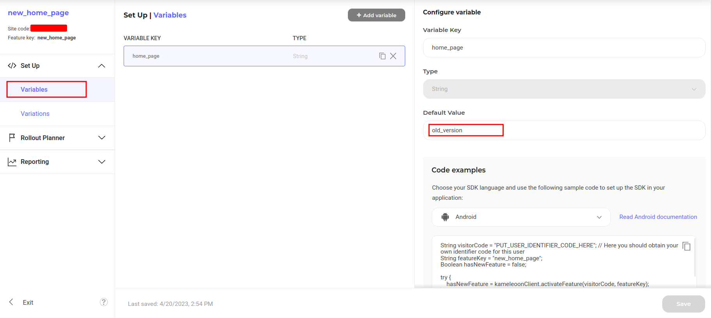
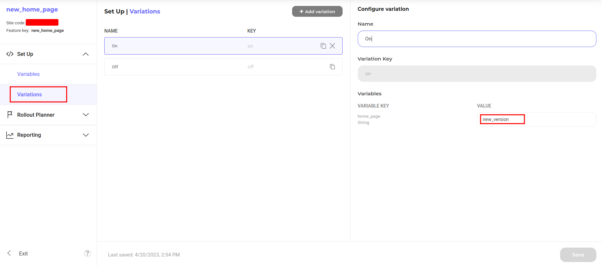
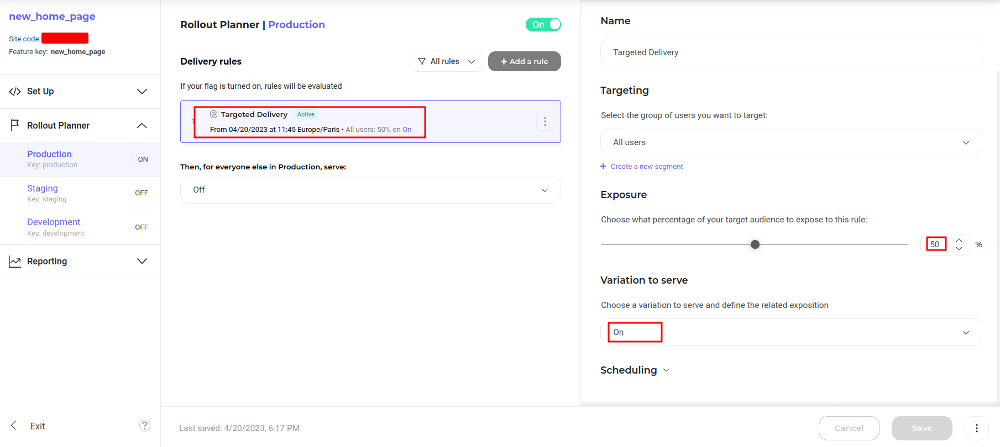
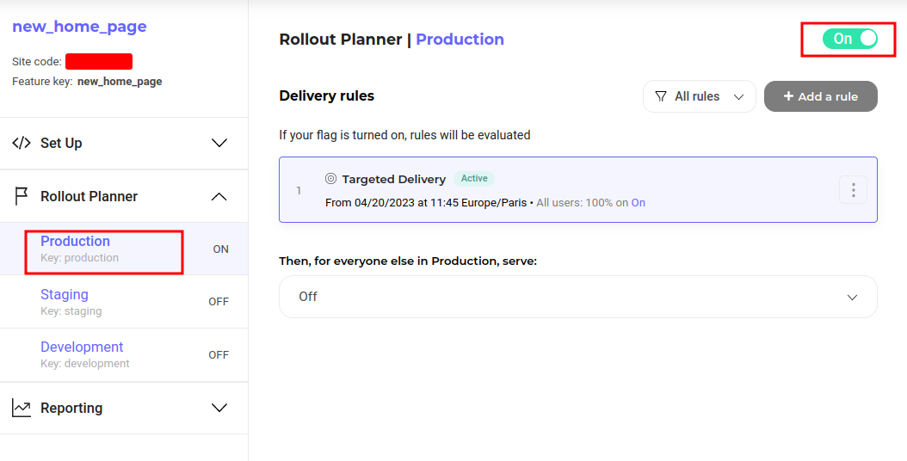

# Feature Flags with Kameleoon

## Demo

https://feature-flag-kameleoon.vercel.app

## How to Use

You can choose from one of the following two methods to use this repository:

### One-Click Deploy

Note: Before clicking Deploy, follow the section [Set up Kameleoon](#setup-kameleoon) to create an account, set up feature flags and obtain the Kameleoon `siteCode`.

[](https://vercel.com/new/clone?repository-url=https://github.com/kameleoon/vercel-starter-kit/tree/main&env=KAMELEOON_SITE_CODE,EDGE_CONFIG&project-name=feature-flag-kameleoon&repository-name=feature-flag-kameleoon)

### Clone and Deploy

Execute [`create-next-app`](https://github.com/vercel/next.js/tree/canary/packages/create-next-app) with [pnpm](https://pnpm.io/installation) to bootstrap the example:

```bash
pnpm create next-app --example https://github.com/kameleoon/vercel-starter-kit/tree/main
```

Note: Before running locally, follow the section [Set up Kameleoon](#setup-kameleoon) to create an account, set up feature flags and obtain the Kameleoon `siteCode`.

Set a `KAMELEOON_SITE_CODE` in `.env.example`, you can get it from Kameleoon platform. Then, copy the `.env.example` file in this directory to `.env.local` (which will be ignored by Git). Below is the command:

```bash
cp .env.example .env.local
```

Next, run Next.js in development mode:

```bash
pnpm dev
```

Deploy it to the cloud with [Vercel](https://vercel.com/new?utm_source=github&utm_medium=readme&utm_campaign=edge-middleware-eap) ([Documentation](https://nextjs.org/docs/deployment)).

# Kameleoon Feature Flag and Experimentation

You can use Kameleoon feature flags at the edge with [NextJS](https://nextjs.org/) applications deployed on [Vercel](https://vercel.com). This Kameleoon Feature Flag middleware uses and extends our [Kameleoon NodeJS SDK](https://developers.kameleoon.com/feature-management-and-experimentation/web-sdks/nodejs-sdk) as a starting point to provide experimentation and feature flagging on the edge. For more information on how to run Feature Flags and Experiments with our platform follow the steps outlined in our documentation [here](https://developers.kameleoon.com/feature-management-and-experimentation/web-sdks/nodejs-sdk).

### Fetch client configuration

The `externalClientConfiguration` is a JSON representation of feature flags and experiments. It contains all the data needed to deliver and track your flag deliveries and experiments. By using our [Kameleoon Integration](https://vercel.com/integrations/kameleoon), you can seamlessly bind your site's configuration to Vercel's Edge Config. Using your site code, it becomes straightforward to retrieve the client configuration from Edge Config.

What sets this approach apart is the efficiency gained from Vercel's CDN. The Edge Config from Vercel ensures rapid fetching of client configurations, capitalizing on the speed and reliability of the Vercel Content Delivery Network.

## Set up Kameleoon

### Get an account

First, you will need to get a [Kameleoon account](https://app.kameleoon.com).

### Create feature flag

In this section, we will create a feature flag with respected variables and variations.

1. Go to `Feature flags` dashboard and click on `New feature flag` button.
2. Give a name `new_home_page`, select the site and click on `Validate` button.
3. Go to `Variables` section, click on `Add variable` button to add a variable.
4. Name it `home_page`, set type to `string` and set default value to `old_version`. This default value will represent the old version of home page.
   
5. Save it. Button is located at the bottom right corner.
6. Go to `Variations` and select `On` default variation. In configure section, find your newly created variable and set new value to `new_version`. This new value represents the new version of home page.
   
7. Save it.

### Create targeted delivery rule

In this section, we will create a targeted rule with variation `On`.

1. Go to `Production` section, click on `Add a rule` and select `Targeted Delivery`.
   
2. Only change the `Variation to serve` to `On` and adjust exposition to `50%`.
   
3. Save it
4. Lastly, enable the feature flag to apply the flag rule.
   
